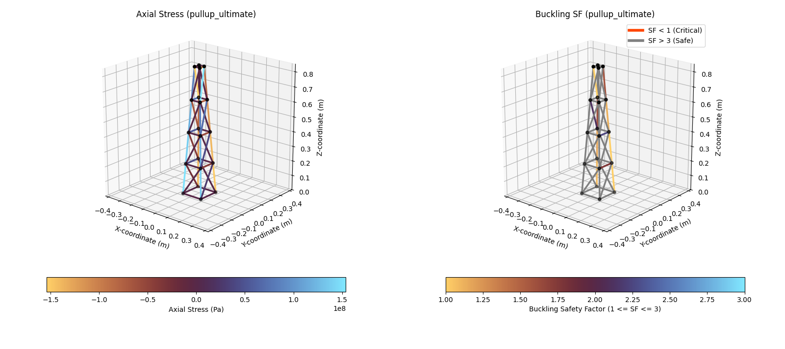
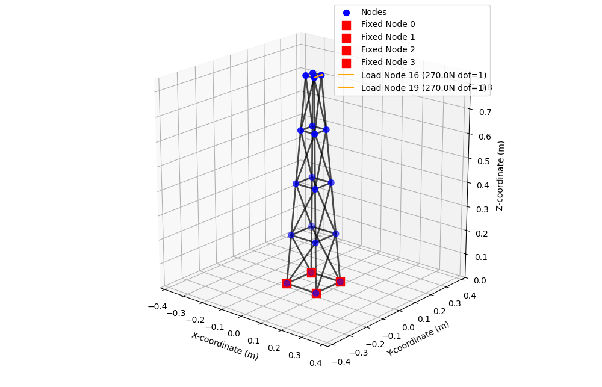
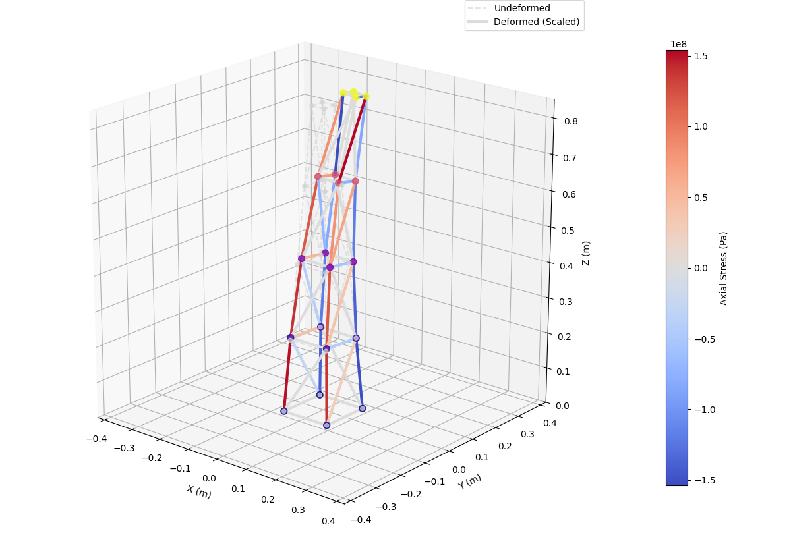

<div align="center">

# Carbon Fiber Truss Generator
### Generative Design & Structural Optimization Pipeline for CFRP Trusses

[](LICENSE)
[](https://www.python.org/)
[-green)](https://docs.scipy.org/doc/scipy/reference/generated/scipy.sparse.linalg.spsolve.html)
[-purple)](#implementation-details)

[](.docs/CONEM2026_0801.pdf) [](#citation)


This repository contains a Python-based generative design pipeline for generating, evaluating and optimizing carbon fiber composite truss structures. The implementation couples a geometry generator, a Finite Element Method (FEM) solver and a Particle Swarm Optimization (PSO) algorithm to find optimal geometric configurations that minimize mass while satisfying structural integrity and safety constraints.

[**English Description**](#en-desc) • [**Descrição em Português**](#pt-desc)
</div>

---
<div align="center">
  
## Visual Gallery (Galeria de Imagens)

<!-- FIGURE 1 BLOCK -->
<p></p>
<div align="center" style="margin-bottom: 50px;"> <!-- Increased gap after first block -->
  <p style="margin: 0 0 5px 0; line-height: 1.2;"> <!-- Tightened paragraph margins -->
    [EN] Figure 1: Axial stress and bucling safety factor distribution.<br>
    <span style="display: inline-block; margin-top: 2px;">[PT] Figura 1: Distribuição de tensões axiais e fatores de segurança de flambagem.</span>
  </p>
   <!-- Tight gap to image -->
</div>
<br></br>
<!-- FIGURES 2 & 3 BLOCK -->
<div align="center">
  <p style="margin: 0 0 5px 0; line-height: 1.2;"> <!-- Tightened paragraph margins -->
    [EN] Figures 2 and 3: Geometrical scheme of the truss & Visualization of the resulting deflection.<br>
    <span style="display: inline-block; margin-top: 2px;">[PT] Figuras 2 e 3: Esquema geométrico da treliça & Apresentação da deformação resultante.</span>
  </p>
  <p align="center" style="margin: 5px 0 0 0;"> <!-- Tight gap to images -->
    
    
  </p>
</div>
</div>

---

# [EN] Carbon Fiber Truss Generator
<a id="en-desc"></a>

This repository contains a Python-based generative design pipeline for generating, evaluating and optimizing carbon fiber composite truss structures. The implementation couples a geometry generator, a Finite Element Method (FEM) solver and a Particle Swarm Optimization (PSO) algorithm to find optimal geometric configurations that minimize mass while satisfying structural integrity and safety constraints.

## Technical Architecture

### Particle Swarm Optimization
The optimization layer utilizes a parallelized Particle Swarm Optimization (PSO) algorithm to optimize structural constraints across the parameter space. The search is executed iteratively:
- **Position Updates**: The velocity and position vectors of the particle swarm are handled efficiently via NumPy arrays to minimize overhead.
- **Structural Evaluation**: To improve computational throughput, objective functions are evaluated concurrently (via `concurrent.futures`).

### Finite Element Method and Composite Mechanics
The structural evaluations rely on a simple truss element formulation, leveraging specific properties for Carbon Fiber Reinforced Polymers (CFRP):
- **Sparse Matrix Formulation**: The global stiffness matrix assembly utilizes `scipy.sparse` (COO/CSR formats) for better memory footprints and fast linear system resolutions via `scipy.sparse.linalg`.
- **Failure Criteria**: The stress states within each member are evaluated against the **Tsai-Wu failure criterion** and local Euler buckling margins, factoring in specialized orthotropic properties ($E_x, G_{xy}$) derived from the defined composite specifications.

## Implementation Details

### Core Modules
* **core/geometry.py**: Parametrically builds the truss geometry and handles node and element definitions.
* **core/truss.py**: Handles physical properties of the truss structure, defining element characteristics (inner and outer diameters) and calculating element properties (sectional area, moment of inertia, etc.).
* **core/fem.py**: Implements the sparse stiffness matrix compilation, application of boundary conditions, and direct linear system solution. It also includes post-processing logic to derive axial stresses, nodal reactions, and local deflections.
* **optimizer/pso.py**: Contains the PSO orchestration logic, managing particle updates and swarm ensemble assembly. It allows configurable hyperparameters, like cognitive and social coefficients and non-linear inertia adjustments.
* **materials/composite_engine.py**: Provides analytical models to derive equivalent mechanical properties for the composite materials.
* **utils/visual.py**: Provides visualization tools to plot convergence metrics, stress distributions, geometric parameters, and overlaid deformed structures resulting from evaluated load cases.

### Execution Flow (`main.py`)
The primary execution script manages the whole generation, evaluation and optimization pipeline:
1. **Optimization Orchestration**: Depending on the runtime configuration, the script initializes either a single PSO instance or an ensemble (for the "Article Mode" run). It manages hyperparameters such as particle count, iteration limits, and ensemble size.
2. **Criteria Evaluation**: The objective function is defined, ran for each design candidate, which maps the input vector to the final mechanical characteristics and truss safety factors. This includes calculating mass and deflection, while enforcing safety factors such as Tsai-Wu, buckling, or joint-shear limits.
3. **Best-Fit Synthesis**: Upon convergence, the script extracts the optimal design vector and performs a final re-analysis. This stage generates fabricable section specifications (e.g., specific tube diameters and wall thicknesses) and summarizes results in the operational envelope.
4. **Diagnostic Visualization**: (Optional) The flow concludes by generating detailed diagnostic plots, including stress distribution maps, buckling margins, and Walbrun-style deformed structure overlays to verify the mechanical performance qualitatively.

--------------

# [PT] Gerador de Estruturas Treliçadas de Compósito
<a id="pt-desc"></a>

Esse repositório consiste em um fluxo de design generativo em Python para construir, avaliar e otimizar estruturas treliçadas de compósito de fibra de carbono. A implementação une um gerador de geometria, um algorítimo de Elementos Finitos (FEM) e um otimizador por enxame de partículas (PSO) para encontrar configurações geométricas ótimas que minimizam a massa enquanto satisfazem critérios de segurança e integridade estrutural.

## Arquitetura Técnica

### Otimização por Enxame de Partículas
O módulo de otimização utiliza um algorítimo de solução paralela para a otimização por enxame de partículas (PSO) para buscar requisitos estruturais ótimos dentro do espaço de parâmetros. A busca é realizada iterativamente:
- **Atualização de Posição**: Os vetores de posição e velocidade das partículas são calculados de maneira eficiente através de matrizes do Numpy.
- **Avaliação Estrutural**: Para melhorar a eficiência computacional, a função objetivo é avaliada para diversas partículas em paralelo (utilizando `concurrent.futures`).
  
### Método dos Elementos Finitos e Mecânica de Compósitos
As avaliações estruturais são baseadas em uma formulação simples de elementos finitos para treliças, acrescentando propriedades específicas para compósitos de fibra de carbono (CFRP):
- **Formulação por Matrizes Esparsas**: A montagem da matriz de rigidez global utiliza matrizes esparsas (`scipy.sparse`) para diminuir o custo de memória e permitir soluções rápidas do sistema linear via `scipy.sparse.linalg`.
- **Critérios de Falha**: Os estados de tensão de cada elemento são avaliados através do **critério de falha de Tsai-Wu** e limites de flambagem de Euler (locais), utilizando propriedades ortotrópicas especializadas ($E_x, G_{xy}$) para o compósito específico definido.

## Detalhes da Implementação

### Módulos Principais
* **core/geometry.py**: Constrói parametricamente a geometria das treliças e resolve definições de nó e elementos.
* **core/truss.py**: Lida com as propriedades físicas da estrutura treliçada, definindo as características dos elementos (diâmetros, etc.) e calculando suas propriedades (como área de seção, momento de inércia, etc.).
* **core/fem.py**: Implementa a montagem das matrizes de rigidez esparsas, a aplicação das condições de contorno, e a solução do sistema linear. Inclui também a lógica de pós-processamento para determinar tensões axiais, reações nos nós e deflexões locais.
* **optimizer/pso.py**: Contem a lógica de coordenação do PSO, administrando a atualização das partículas e a construção de conjunto de enxames. Permite hiperparâmetros configuráveis como coeficientes cognitivos e sociais, e ajustes de inércia não-linear.
* **materials/composite_engine.py**: Consiste em modelos analíticos para o cálculo das propriedades mecânicas dos materiais compósitos.
* **utils/visual.py**: Disponibiliza ferramentas de visualização para plotar métricas de convergência, distribuição de tensões, parâmetros geométricos e esquemas de deformação da estrutura.
  
### Processo de Execução (`main.py`)
O script principal de execução gere o processo completo de geração, avaliação e otimização:
1. **Coordenação da Otimização**: Dependendo da configuração de execução, o script inicializa um único enxame de otimização ou um conjunto de enxames (para o "Article Mode"). São definidos hiperparâmetros como número de partículas, iterações máximas e número de enxames.
2. **Avaliação de Critérios**: É definida a função objetivo que, para cada estrutura candidata, mapeia o vetor de entrada para as características mecânicas e fatores de segurança da treliça. Isso inclui o cálculo de massa total e deformação, além da avaliação dos limites de segurança para Tsai-Wu, flambagem e integridade das conexões. 
3. **Síntese da Solução Ideal**: Após a convergência, o script extrai o design ótimo e o analisa novamente. Nesse estágio são geradas as especificações de manufatura (e.g., diâmetro dos tubos e espessuras) e resume os resultados estruturais no envelope de operação.
4. **Visualização de Resultados**: (Opcional) O processo conclui gerando gráficos de diagnóstico, incluindo distribuição de tensões, limites de flambagem, e uma visualização da estrutura deformada (estilo Walbrun) para verificar qualitativamente o desempenho mecânico da estrutura.

---

## Academic Publication

This generative design framework and its structural formulation were presented and published at the **National Congress of Mechanical Engineering (CONEM 2026)**.

* **Paper Title**: *Desenvolvimento de Framework Computacional em Python para Design e Otimização de Estruturas Treliçadas em Fibra de Carbono*
* **Authors**: *Pedro Henrique Castro Alves*, *Maurício Menegatti Andrade*, *Livia Caetano de Andrade*, *Ismael Antônio Agostini*
* **Conference**: CONEM 2026 – Congresso Nacional de Engenharia Mecânica
* **Document**: [`[Read PDF]`](.docs/CONEM2026_0801.pdf)

### Citation

```bibtex
@inproceedings{alves2026conem,
  author    = {Alves, Pedro Henrique Castro and Andrade, Maur{\'{\i}}cio Menegatti and de Andrade, L{\'{\i}}via Caetano and Agostini, Ismael Ant{\^o}nio},
  title     = {Desenvolvimento de Framework Computacional em {Python} para Design e Otimiza{\c{c}}{\~a}o de Estruturas Treli{\c{c}}adas em Fibra de Carbono},
  booktitle = {Anais do XIII Congresso Nacional de Engenharia Mec{\^a}nica (CONEM 2026)},
  year      = {2026},
  month     = {aug},
  publisher = {Associa{\c{c}}{\~a}o Brasileira de Engenharia e Ci{\^e}ncias Mec{\^a}nicas (ABCM)},
  note      = {Artigo CONEM2026-0801}
}
```
